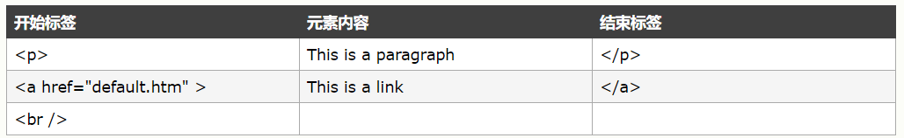

# 一、HTML简介

## 1.1、HTML 是用来描述网页的一种语言。

- HTML 指的是超文本标记语言 (**H**yper **T**ext **M**arkup **L**anguage)
- HTML 不是一种编程语言，而是一种*标记语言* (markup language)
- 标记语言是一套*标记标签* (markup tag)
- HTML 使用*标记标签*来描述网页

## 1.2、HTML 标签

HTML 标记标签通常被称为 HTML 标签 (HTML tag)。

- HTML 标签是由*尖括号*包围的关键词，比如 \<html>
- HTML 标签通常是*成对出现*的，比如 \<b> 和 \</b>
- 标签对中的第一个标签是*开始标签*，第二个标签是*结束标签*
- 开始和结束标签也被称为*开放标签*和*闭合标签*


## 1.3、HTML 文档 = 网页

- HTML 文档*描述网页*
- HTML 文档*包含 HTML 标签*和纯文本
- HTML 文档也被称为*网页*

Web 浏览器的作用是读取 HTML 文档，并以网页的形式显示出它们。浏览器不会显示 HTML 标签，而是使用标签来解释页面的内容.


# 二、HTML基础

## 2.1、标签

### 2.1.1、HTML 标题

HTML 标题（Heading）是通过 \<h1> - \<h6> 等标签进行定义的。

### 2.1.2、HTML 段落

HTML 段落是通过 \<p> 标签进行定义的。

### 2.1.3、HTML 链接

HTML 链接是通过 \<a> 标签进行定义的，在 href 属性中指定链接的地址。

```html
<a href="http://www.w3school.com.cn">This is a link</a>
```

### 2.1.4、HTML 图像

HTML 图像是通过 \ 标签进行定义的,图像的名称和尺寸是以属性的形式提供的。

```html

```

## 2.2、HTLM元素

HTML 元素指的是从开始标签（start tag）到结束标签（end tag）的所有代码，开始标签常被称为开放标签（opening tag），结束标签常称为闭合标签（closing tag）。



### 2.2.1、HTML 元素语法

- HTML 元素以*开始标签*起始
- HTML 元素以*结束标签*终止
- *元素的内容*是开始标签与结束标签之间的内容
- 某些 HTML 元素具有*空内容（empty content）*
- 空元素*在开始标签中进行关闭*（以开始标签的结束而结束）
- 大多数 HTML 元素可拥有*属性*

### 2.2.2空的 HTML 元素

没有内容的 HTML 元素被称为空元素。空元素是在开始标签中关闭的。

\<br> 就是没有关闭标签的空元素（\<br> 标签定义换行）。

在 XHTML、XML 以及未来版本的 HTML 中，所有元素都必须被关闭。

在开始标签中添加斜杠，比如 \<br />，是关闭空元素的正确方法，HTML、XHTML 和 XML 都接受这种方式。

即使 \<br> 在所有浏览器中都是有效的，但使用 \<br /> 其实是更长远的保障。

### 2.2.3HTML 提示：使用小写标签

HTML 标签对大小写不敏感：\<P> 等同于\ <p>。许多网站都使用大写的 HTML 标签。

W3School 使用的是小写标签，因为万维网联盟（W3C）在 HTML 4 中*推荐*使用小写，而在未来 (X)HTML 版本中*强制*使用小写。

## 2.3、HTML属性

**属性为 HTML 元素提供附加信息。**

### 2.3.1、HTML 属性

HTML 标签可以拥有*属性*。属性提供了有关 HTML 元素的*更多的信息*。

属性总是以名称/值对的形式出现，比如：*name="value"*。

属性总是在 HTML 元素的*开始标签*中规定。

### 2.3.2、属性实例

1、HTML 链接由\<a> 标签定义。链接的地址在 href 属性中指定：

```html
<a href="http://www.w3school.com.cn">This is a link</a>
```

2、示例2

```html
<html>

<body>

<h1 align="center">This is heading 1</h1>

<p>上面的标题在页面中进行了居中排列。上面的标题在页面中进行了居中排列。上面的标题在页面中进行了居中排列。</p>

</body>
</html>
```

###   2.3.3、HTML 提示：使用小写属性

属性和属性值对大小写*不敏感*。

不过，万维网联盟在其 HTML 4 推荐标准中推荐小写的属性/属性值。

而新版本的 (X)HTML 要求使用小写属性。

### 2.3.4、始终为属性值加引号

属性值应该始终被包括在引号内。双引号是最常用的，不过使用单引号也没有问题。

在某些个别的情况下，比如属性值本身就含有双引号，那么您必须使用单引号，例如：

```
name='Bill "HelloWorld" Gates'
```

### 2.3.5、HTML 属性参考手册

链接：<http://www.w3school.com.cn/tags/index.asp>

## 2.4、HTML 标题

标题（Heading）是通过 \<h1> - \<h6> 等标签进行定义的。

\<h1> 定义最大的标题。\<h6> 定义最小的标题。(浏览器会自动地在标题的前后添加空行。默认情况下，HTML 会自动地在块级元素前后添加一个额外的空行，比如段落、标题元素前后。)

### 2.4.1、HTML 水平线

\<hr /> 标签在 HTML 页面中创建水平线。

hr 元素可用于分隔内容。

```html
<p>This is a paragraph</p>
<hr />
<p>This is a paragraph</p>
<hr />
<p>This is a paragraph</p>
```

### 2.4.2、HTML 注释

可以将注释插入 HTML 代码中，这样可以提高其可读性，使代码更易被人理解。浏览器会忽略注释，也不会显示它们。注释是这样写的：

```html
<!-- This is a comment -->
```

## 2.5、HTML段落

段落是通过 \<p> 标签定义的。浏览器会自动地在段落的前后添加空行。（\<p> 是块级元素）

**提示：**使用空的段落标记\<p>\</p> 去插入一个空行是个坏习惯。

2.5.1、HTML 折行

如果您希望在不产生一个新段落的情况下进行换行（新行），请使用 \<br /> 标签：

```html
<p>This is<br />a para<br />graph with line breaks</p>
```

\<br /> 元素是一个空的 HTML 元素。由于关闭标签没有任何意义，因此它没有结束标签。

您也许发现 \<br> 与 \<br /> 很相似。

在 XHTML、XML 以及未来的 HTML 版本中，不允许使用没有结束标签（闭合标签）的 HTML 元素。

即使\<br> 在所有浏览器中的显示都没有问题，使用 \<br /> 也是*更长远的保障*。

## 2.6、HTML样式

## 2.7、HTML格式化

## 2.8、HTML引用

引用（Quotation）

### 2.8.1、短引用

HTML \<q> 用于短的引用

HTML *\<q>* 元素定义*短的引用*。

浏览器通常会为 \<q> 元素包围*引号*。

```html
<p>WWF 的目标是：<q>构建人与自然和谐共存的世界。</q></p>
```

### 2.8.2、长引用

用于长引用的 HTML \<blockquote>HTML *\<blockquote>* 元素定义被引用的节。

浏览器通常会对 \<blockquote> 元素进行*缩进*处理。

```html
<p>以下内容引用自 WWF 的网站：</p>
<blockquote cite="http://www.worldwildlife.org/who/index.html">
五十年来，WWF 一直致力于保护自然界的未来。
世界领先的环保组织，WWF 工作于 100 个国家，
并得到美国一百二十万会员及全球近五百万会员的支持。
</blockquote>
```

### 2.8.3、用于缩略词的 HTML \<abbr>

HTML *\<abbr>* 元素定义*缩写*或首字母缩略语。

对缩写进行标记能够为浏览器、翻译系统以及搜索引擎提供有用的信息。

```html
<p><abbr title="World Health Organization">WHO</abbr> 成立于 1948 年。</p>
```

### 2.8.4、用于定义的 HTML \<dfn>

HTML *\<dfn>* 元素定义项目或缩写的*定义*。

\<dfn> 的用法，按照 HTML5 标准中的描述，有点复杂：

1、如果设置了 \<dfn> 元素的 title 属性，则定义项目：

```html
<p><dfn title="World Health Organization">WHO</dfn> 成立于 1948 年。</p>
```

2、如果 \<dfn> 元素包含具有标题的 \<abbr> 元素，则 title 定义项目：

```HTML
<p><dfn><abbr title="World Health Organization">WHO</abbr></dfn> 成立于 1948 年。</p>
```

3、否则，\<dfn> 文本内容即是项目，并且父元素包含定义。

```HTML
<p><dfn>WHO</dfn> World Health Organization 成立于 1948 年。</p>
```

### 2.8.5、用于联系信息的 HTML <address>

HTML *<address>* 元素定义文档或文章的联系信息（作者/拥有者）。

此元素通常以*斜体*显示。大多数浏览器会在此元素前后添加折行。

```
<address>
Written by Donald Duck.<br> 
Visit us at:<br>
Example.com<br>
Box 564, Disneyland<br>
USA
</address>
```

### 2.8.6、用于著作标题的 HTML \<cite>

HTML *\<cite>* 元素定义*著作的标题*。

浏览器通常会以斜体显示 \<cite> 元素。

```HTML 
<p><cite>The Scream</cite> by Edward Munch. Painted in 1893.</p>
```

